# 🛡️ Infraestructura 1 — DMZ con FortiGate, VLAN y Dos Switches

**Albert Euclides Garcia — Matrícula 2025-2241 (`20252241`)**


> Un firewall FortiGate (configurado 100 % por GUI) segmenta la red en dos VLAN de usuarios y una **DMZ** para los servidores. La DMZ no puede enviar tráfico hacia la LAN, solo sale a Internet para resolver DNS y descargar actualizaciones de Ubuntu, y el acceso a los servidores queda restringido por VLAN y por servicio.

---

## 📺 Video de Demostración

> **[Ver demostración en YouTube →](https://www.youtube.com/watch?v=p6P9Ry5njmM)**

---

## 📑 Tabla de Contenido

1. [Propósito del Laboratorio](#-propósito-del-laboratorio)
2. [Cumplimiento de Requisitos](#-cumplimiento-de-requisitos)
3. [Direccionamiento IP basado en la matrícula (VLSM)](#-direccionamiento-ip-basado-en-la-matrícula-vlsm)
4. [Parámetros Usados](#-parámetros-usados)
5. [Documentación de la Red](#️-documentación-de-la-red)
6. [Funcionamiento de la Configuración](#-funcionamiento-de-la-configuración)
7. [Validación de la Implementación](#-validación-de-la-implementación)
8. [Scripts](#-scripts)
9. [Estructura del Repositorio](#-estructura-del-repositorio)

---

## 🎯 Propósito del Laboratorio

Demostrar una red segura con servidores aislados en una **DMZ**, aplicando estas políticas:

- Los servidores (Sistema de Caja, Sistema de Inventario y servidor de datos) viven en una **VLAN de DMZ** independiente.
- La DMZ **no puede iniciar tráfico hacia las redes de usuarios** (sin fuga hacia la LAN).
- La DMZ **no tiene acceso abierto a Internet**: solo puede consultar DNS y llegar a los endpoints de actualización de Ubuntu.
- Solo la **VLAN 20** puede entrar por **SSH** a los servidores.
- La **VLAN 10** tiene restringido el acceso al **Sistema de Inventario** y, al intentarlo, ve una página de violación de política.
- La infraestructura usa **dos switches** con VLAN y seguridad básica de red.

---

## ✅ Cumplimiento de Requisitos

| Requisito | Implementado con |
| --- | --- |
| Todo el FortiGate por GUI | Interfaces, DHCP, rutas, objetos, perfiles y políticas configurados desde la interfaz web de FortiOS |
| LAN de los servidores en una DMZ | Subinterfaz `vlan30-dmz` (VLAN 30) sobre `port2`, red `10.22.42.0/28` |
| Políticas que eviten fuga hacia la LAN | `block-dmz-to-vlan10` y `block-dmz-to-vlan20` (DENY desde la DMZ hacia cada VLAN de usuarios) |
| DMZ sin acceso abierto a Internet | `block-dmz-internet` (DENY a todo) por debajo de las únicas dos salidas permitidas |
| DMZ solo a endpoints de actualización | `DNS-DMZ` (solo DNS hacia `server-dns`) y `DMZ-UBUNTU-UPDATES` (HTTP/HTTPS solo hacia `ubuntu-update-endpoints`) |
| VLAN 20 única con SSH a los servidores | `VLAN-20-SSH-DMZ` (ACCEPT) y `BLOCK-VLAN10-SSH-DMZ` (DENY); el resto cae en el *Implicit Deny* |
| VLAN 10 restringida al Sistema de Inventario | `vlan10-block-inv` con perfil de Web Filter `block-inv-vlan10`; el usuario ve la página de bloqueo |
| 2 switches con VLAN | `switch-2241-1` (usuarios) y `switch-2241-2` (DMZ), unidos por un trunk |
| Seguridad básica de red en los switches | Port-security (MAC sticky, máximo 1, violation restrict), portfast + BPDU guard, puertos sin uso apagados en la VLAN 999, VLAN nativa 999 en el trunk entre switches, `no ip http server` en SW2 |
| 3 servidores (/28) | Caja, Inventario y Datos en `10.22.42.0/28` |
| 2 usuarios (/25) con DHCP | VLAN 10 `10.22.41.0/25` y VLAN 20 `10.22.41.128/25`, ambas con servidor DHCP en el FortiGate |
| Direccionamiento basado en la matrícula | Redes derivadas de los dígitos `22` y `41` de la matrícula, subdivididas con VLSM |
| Repositorio con video, documentación, diagramas, imágenes y running-configs | Este repositorio |

---

## 🧮 Direccionamiento IP basado en la matrícula (VLSM)

### 1. Origen de las direcciones

Mi matrícula es **2025-2241** (`20252241`). Tomé sus últimos cuatro dígitos, `2241`, separados en dos pares, **`22`** y **`41`**:

| Dígitos de la matrícula | Dónde se usan | Ejemplo |
| --- | --- | --- |
| `22` → segundo octeto | Redes LAN privadas (usuarios y DMZ) | 10.**22**.41.0 |
| `41` → tercer octeto | Redes de usuarios | 10.22.**41**.0 |
| `22.41` → dos primeros octetos | Enlace "público" entre el ISP y el FortiGate | **22.41**.3.0/30 |

### 2. Subdivisión con VLSM

Se asignó primero la subred más grande y después las más pequeñas, con el prefijo justo para los hosts de cada segmento y sin solapamientos.

| # | Segmento | Prefijo | Máscara | Hosts útiles | Red | Rango utilizable | Broadcast |
| --- | --- | --- | --- | --- | --- | --- | --- |
| 1 | Usuarios VLAN 10 | /25 | 255.255.255.128 | 126 | 10.22.41.0 | 10.22.41.1 – 10.22.41.126 | 10.22.41.127 |
| 2 | Usuarios VLAN 20 | /25 | 255.255.255.128 | 126 | 10.22.41.128 | 10.22.41.129 – 10.22.41.254 | 10.22.41.255 |
| 3 | DMZ (VLAN 30) | /28 | 255.255.255.240 | 14 | 10.22.42.0 | 10.22.42.1 – 10.22.42.14 | 10.22.42.15 |
| 4 | Enlace ISP ↔ FortiGate | /30 | 255.255.255.252 | 2 | 22.41.3.0 | 22.41.3.1 – 22.41.3.2 | 22.41.3.3 |

**Cálculo de cada prefijo:**

- **/25:** 32 − 25 = 7 bits de host → 2⁷ = 128 direcciones → 126 hosts útiles.
- **/28:** 32 − 28 = 4 bits de host → 2⁴ = 16 direcciones → 14 hosts útiles.
- **/30:** 32 − 30 = 2 bits de host → 2² = 4 direcciones → 2 hosts útiles, los justos para un enlace punto a punto.

### 3. Asignación de direcciones

| Dispositivo | Interfaz | IP | Subred |
| --- | --- | --- | --- |
| FortiGate | `user-valn10` (VLAN 10, sobre port2) | 10.22.41.1 | 10.22.41.0/25 |
| FortiGate | `USER-VLAN20` (VLAN 20, sobre port2) | 10.22.41.129 | 10.22.41.128/25 |
| FortiGate | `vlan30-dmz` (VLAN 30, sobre port2) | 10.22.42.1 | 10.22.42.0/28 |
| FortiGate | `WAN-ISP` (port1) | 22.41.3.2 | 22.41.3.0/30 |
| FortiGate | `port3` (administración por GUI) | 192.168.237.2 | 192.168.237.0/24 |
| ISP | FastEthernet1/0 | 22.41.3.1 | 22.41.3.0/30 |
| ISP | FastEthernet0/0 (salida a Internet) | DHCP (NAT1) | 192.168.42.0/24 |
| Usuario VLAN 10 | ens3 (DHCP, rango .10 – .100) | 10.22.41.x | 10.22.41.0/25 |
| Usuario VLAN 20 | ens3 (DHCP, rango .140 – .230) | 10.22.41.x | 10.22.41.128/25 |
| Servidor Caja | ens3 | 10.22.42.2 | 10.22.42.0/28 |
| Servidor Inventario | ens3 | 10.22.42.3 | 10.22.42.0/28 |
| Servidor Datos | ens3 | 10.22.42.4 | 10.22.42.0/28 |

**Evidencia:**

Interfaces del router ISP:

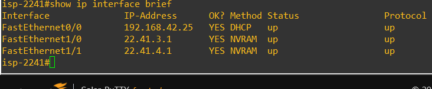

Interfaces del FortiGate (subinterfaces sobre `port2` y `WAN-ISP`):

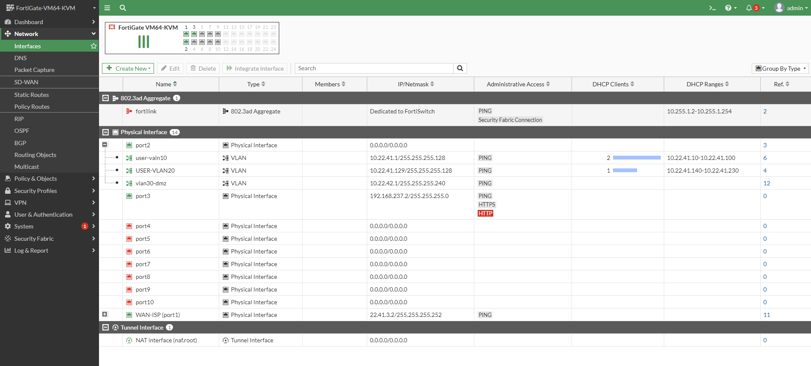

Servidores DHCP de las VLAN 10 y 20:

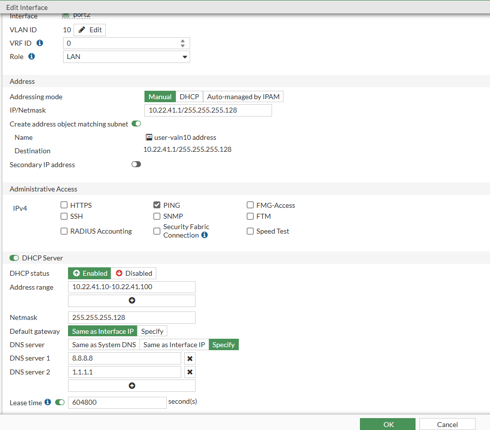

---

## 🧩 Parámetros Usados

| Parámetro | Valor |
| --- | --- |
| Plataforma FortiGate | FortiGate-VM64-KVM, FortiOS 7.0.9 |
| ISP | Router Cisco 7200 (`isp-2241`) con NAT overload hacia FastEthernet0/0 |
| Switches | Cisco IOSvL2: `switch-2241-1` (usuarios y salida al FortiGate) y `switch-2241-2` (DMZ) |
| Emulador | GNS3 con GNS3 VM sobre VMware Workstation |
| Servidores y usuarios | Ubuntu Server (consola por VNC) |
| VLAN 10 | `USER_VLAN10` — `10.22.41.0/25`, gateway `10.22.41.1`, DHCP `.10 – .100` |
| VLAN 20 | `USER_VLAN20` — `10.22.41.128/25`, gateway `10.22.41.129`, DHCP `.140 – .230` |
| VLAN 30 | `DMZ_SERVERS` — `10.22.42.0/28`, gateway `10.22.42.1` |
| VLAN 999 | `UNUSED_PORTS` — puertos sin uso apagados y VLAN nativa del trunk entre switches |
| Trunk entre switches | SW1 `Gi1/2` ↔ SW2 `Gi0/0`, solo VLAN 30, VLAN nativa 999 |
| Trunk hacia el FortiGate | SW1 `Gi0/0` ↔ FortiGate `port2`, VLAN 10, 20 y 30 |

---

## 🗺️ Documentación de la Red

### Topología

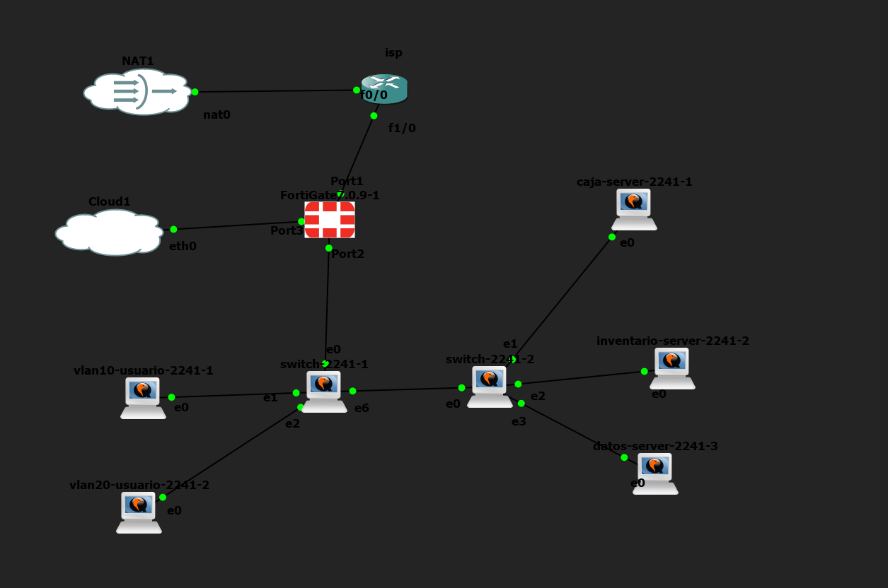

### Diagrama lógico

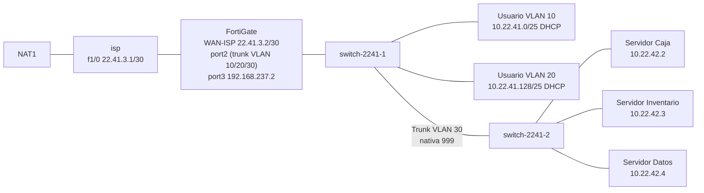
```mermaid
flowchart LR
    NAT["NAT1"] --- ISP["isp<br/>f1/0 22.41.3.1/30"]
    ISP --- FG["FortiGate<br/>WAN-ISP 22.41.3.2/30<br/>port2 (trunk VLAN 10/20/30)<br/>port3 192.168.237.2"]
    FG --- SW1["switch-2241-1"]
    SW1 --- U10["Usuario VLAN 10<br/>10.22.41.0/25 DHCP"]
    SW1 --- U20["Usuario VLAN 20<br/>10.22.41.128/25 DHCP"]
    SW1 -- "Trunk VLAN 30<br/>nativa 999" --- SW2["switch-2241-2"]
    SW2 --- CAJA["Servidor Caja<br/>10.22.42.2"]
    SW2 --- INV["Servidor Inventario<br/>10.22.42.3"]
    SW2 --- DATOS["Servidor Datos<br/>10.22.42.4"]
```

### Diagrama de acceso (qué puede hacer cada red)

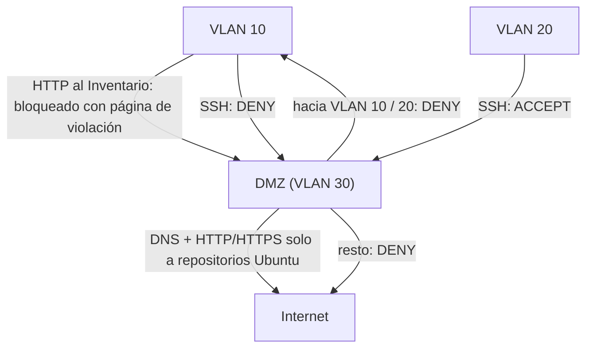
```mermaid
flowchart TB
    V10["VLAN 10"] -- "HTTP al Inventario: bloqueado con página de violación" --> DMZ
    V10 -- "SSH: DENY" --> DMZ
    V20["VLAN 20"] -- "SSH: ACCEPT" --> DMZ["DMZ (VLAN 30)"]
    DMZ -- "hacia VLAN 10 / 20: DENY" --> V10
    DMZ -- "DNS + HTTP/HTTPS solo a repositorios Ubuntu" --> NET["Internet"]
    DMZ -- "resto: DENY" --> NET
```

### Switches y VLAN

`switch-2241-1` — VLAN y trunks:

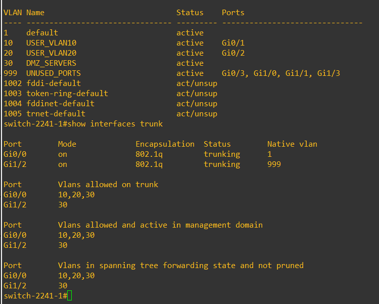

`switch-2241-2` — VLAN y trunk hacia SW1:

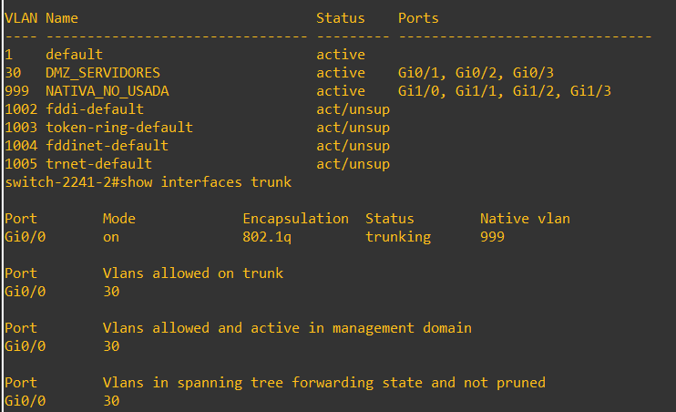

Port-security en los puertos de los servidores (`switch-2241-2`):

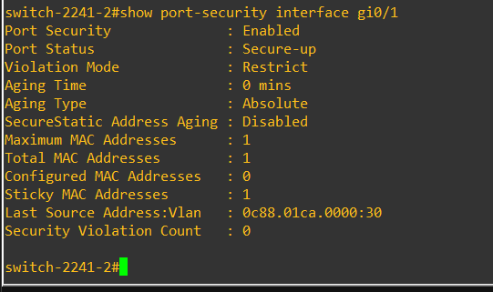

### Usuarios y servidores

Usuarios de la VLAN 10 y 20 con IP por DHCP:

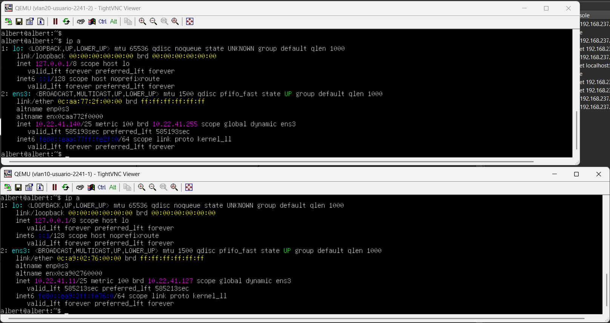

Servidores de la DMZ con sus IP:

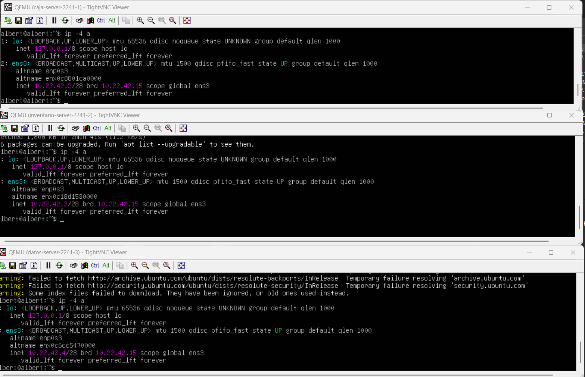

### FortiGate

Rutas estáticas:

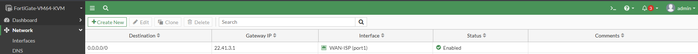

Objetos de direcciones (`ubuntu-update-endpoints`, `server-dns`, servidores):

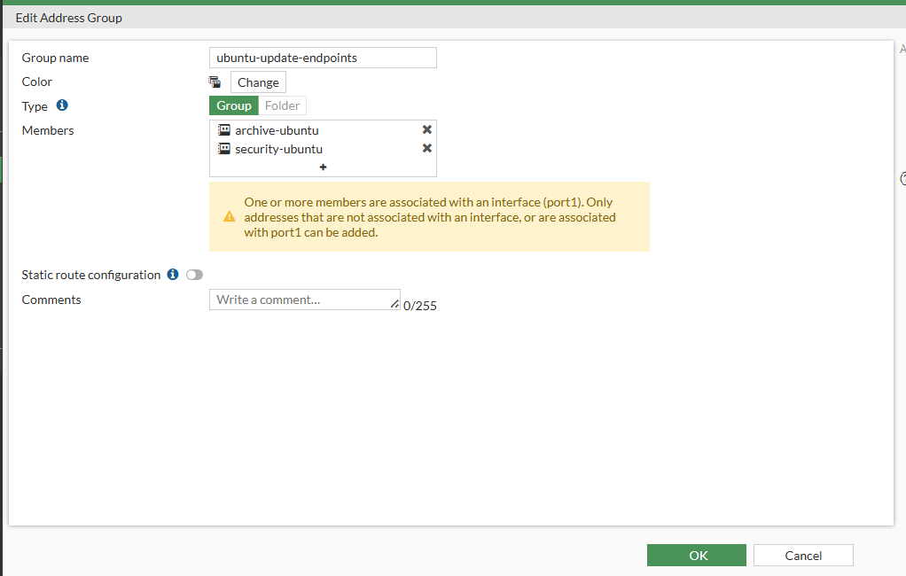

Perfil de Web Filter que restringe a la VLAN 10 el Sistema de Inventario:

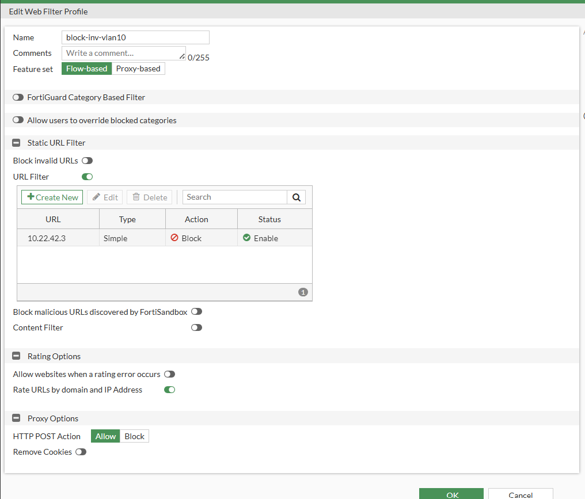

DNS del FortiGate:

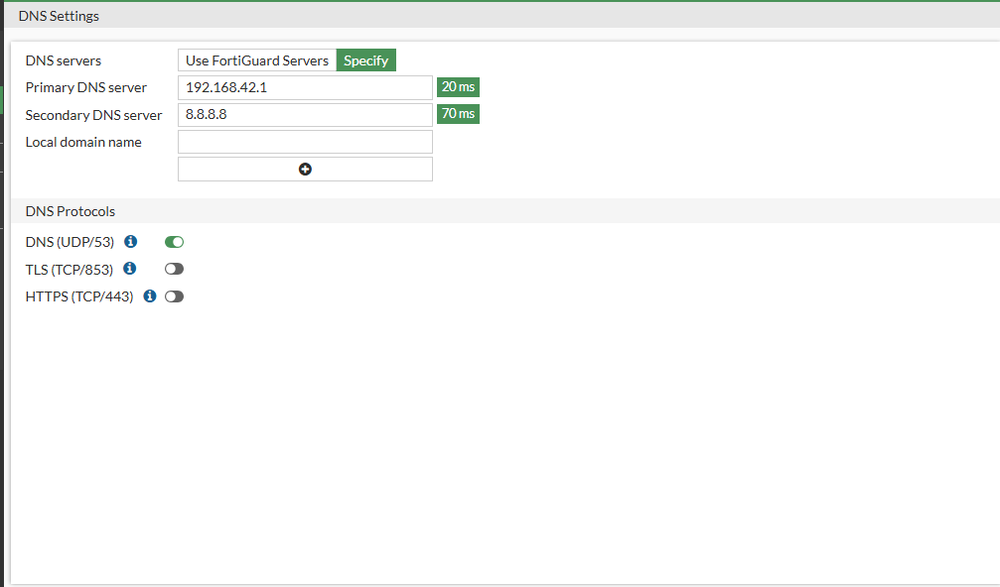

Políticas de firewall:

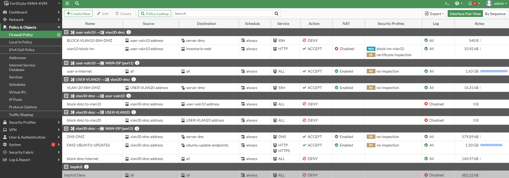

---

## 🔬 Funcionamiento de la Configuración

**Segmentación:** `switch-2241-1` entrega la VLAN 10 y la VLAN 20 a los usuarios y las lleva por trunk al FortiGate (`port2`), junto con la VLAN 30. El FortiGate termina cada VLAN como una subinterfaz 802.1Q (`user-valn10`, `USER-VLAN20` y `vlan30-dmz`) y entrega direcciones por DHCP a los usuarios. La VLAN 30 continúa por un trunk hacia `switch-2241-2`, donde se conectan los tres servidores de la DMZ.

**Seguridad de los switches:**

- Puertos de acceso con *port-security* (MAC sticky, máximo 1 dirección, violation `restrict`), *portfast* y *BPDU guard*.
- Puertos sin uso apagados y asignados a la VLAN 999.
- El trunk entre switches solo permite la VLAN 30 y usa la VLAN 999 como nativa.
- Servidor HTTP del IOS desactivado en `switch-2241-2`.

**Políticas de firewall** (evaluadas de arriba hacia abajo):

| # | Política | Origen → Destino | Servicio | Acción |
| --- | --- | --- | --- | --- |
| 1 | `BLOCK-VLAN10-SSH-DMZ` | VLAN 10 → servidores (`server-dmz`) | SSH | DENY |
| 2 | `vlan10-block-inv` | VLAN 10 → `inventario-web` | HTTP | ACCEPT con Web Filter `block-inv-vlan10` (bloquea la URL y muestra la página de violación) |
| 3 | `user-a-internet` | VLAN 10 → Internet | ALL | ACCEPT, con NAT |
| 4 | `VLAN-20-SSH-DMZ` | VLAN 20 → servidores (`server-dmz`) | SSH | ACCEPT, con NAT |
| 5 | `block-dmz-to-vlan10` | DMZ → VLAN 10 | ALL | DENY |
| 6 | `block-dmz-to-vlan20` | DMZ → VLAN 20 | ALL | DENY |
| 7 | `DNS-DMZ` | DMZ → `server-dns` | DNS | ACCEPT, con NAT |
| 8 | `DMZ-UBUNTU-UPDATES` | DMZ → `ubuntu-update-endpoints` | HTTP, HTTPS | ACCEPT, con NAT |
| 9 | `block-dmz-internet` | DMZ → Internet | ALL | DENY |
| 10 | Implicit Deny | all → all | ALL | DENY |

- Las políticas 1 y 4 hacen que **solo la VLAN 20** tenga SSH a los servidores; cualquier otro origen cae en el *Implicit Deny*.
- La política 2 deja pasar el HTTP de la VLAN 10 hacia el inventario, pero el perfil de Web Filter lo bloquea y el usuario ve la violación de política.
- Las políticas 5 y 6 impiden que la DMZ inicie tráfico hacia las redes de usuarios.
- Las políticas 7 y 8 son las únicas salidas de la DMZ: resolver nombres y descargar actualizaciones de los repositorios de Ubuntu. La 9 bloquea todo lo demás.

**Salida a Internet (ISP):** el router `isp` hace NAT overload de las redes del FortiGate hacia su interfaz `FastEthernet0/0` (`ip nat inside source list 1 interface FastEthernet0/0 overload`). Su configuración completa está en `running-configs/isp.txt`.

---

## ✅ Validación de la Implementación

**Prueba 1 — La DMZ no llega a la LAN ni a Internet abierto:** desde el servidor de Caja, el ping a un usuario de la VLAN 20 y a `8.8.8.8` no tiene respuesta.

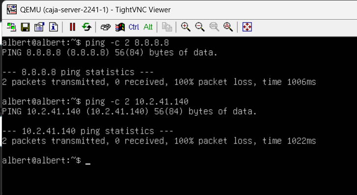

**Prueba 2 — La DMZ solo sale a los endpoints de actualización:** desde el servidor de Inventario, `archive.ubuntu.com` responde y `example.com` agota el tiempo.

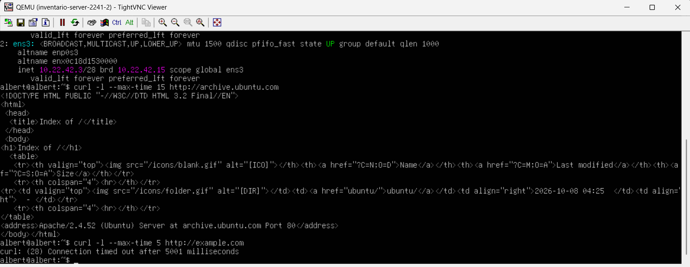

**Prueba 3 — Actualización del sistema:** `sudo apt update` descarga los índices de los repositorios de Ubuntu a través de la política `DMZ-UBUNTU-UPDATES`.

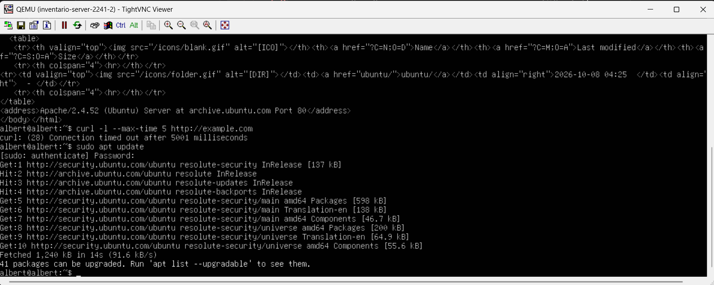

**Prueba 4 — SSH desde la VLAN 20:** el usuario de la VLAN 20 entra por SSH al servidor.

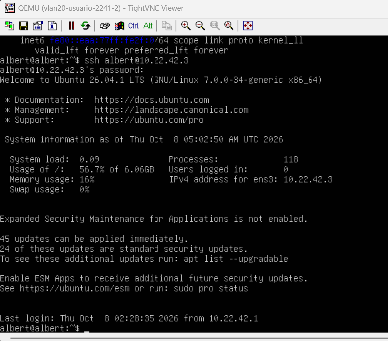

**Prueba 5 — SSH desde la VLAN 10:** el intento queda sin respuesta porque la política `BLOCK-VLAN10-SSH-DMZ` lo bloquea.

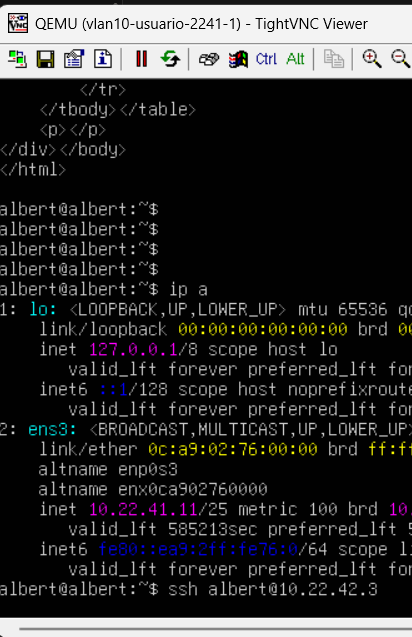

**Prueba 6 — La VLAN 10 no accede al Inventario:** al intentar abrir la página, el usuario recibe la página de acceso bloqueado (*Local URLfilter Block*), es decir, presencia que violó una política.

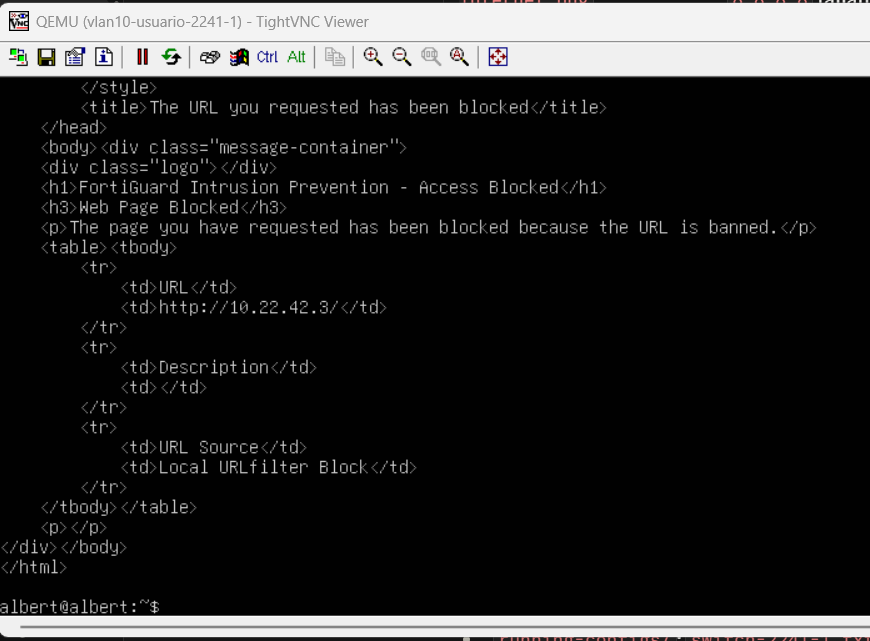

**Prueba 7 — Registro en el FortiGate:** el *Forward Traffic* muestra el tráfico permitido y bloqueado de las pruebas anteriores, con la política aplicada a cada sesión.

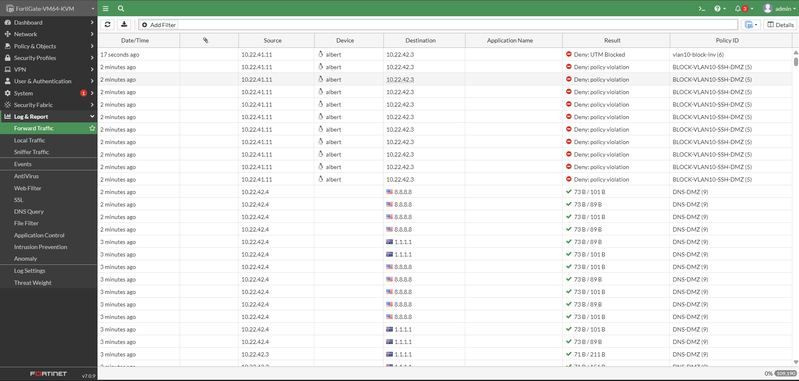

---

## 📜 Scripts

### Scripts de configuración

Los equipos de red se configuraron por consola con los comandos de abajo; las configuraciones finales completas están en `running-configs/`.

<details>
<summary><b>switch-2241-2</b> (switch de la DMZ)</summary>

```
enable
configure terminal
hostname switch-2241-2
service password-encryption
enable secret <contraseña>
no ip http server
no ip http secure-server
banner motd ^C ACCESO SOLO A PERSONAL AUTORIZADO ^C
!
vlan 30
 name DMZ_SERVIDORES
vlan 999
 name NATIVA_NO_USADA
!
interface GigabitEthernet0/0
 description trunk_to_switch-2241-1
 switchport trunk encapsulation dot1q
 switchport mode trunk
 switchport trunk native vlan 999
 switchport trunk allowed vlan 30
 switchport nonegotiate
 no shutdown
!
interface GigabitEthernet0/1
 description WEB_CAJA_DMZ
 switchport mode access
 switchport access vlan 30
 switchport port-security
 switchport port-security mac-address sticky
 switchport port-security violation restrict
 spanning-tree portfast edge
 spanning-tree bpduguard enable
!
interface GigabitEthernet0/2
 description WEB_INVENTARIO_DMZ
 switchport mode access
 switchport access vlan 30
 switchport port-security
 switchport port-security mac-address sticky
 switchport port-security violation restrict
 spanning-tree portfast edge
 spanning-tree bpduguard enable
!
interface GigabitEthernet0/3
 description DB_SERVER_DMZ
 switchport mode access
 switchport access vlan 30
 switchport port-security
 switchport port-security mac-address sticky
 switchport port-security violation restrict
 spanning-tree portfast edge
 spanning-tree bpduguard enable
!
interface range GigabitEthernet1/0 - 3
 description UNUSED_DISABLED
 switchport mode access
 switchport access vlan 999
 shutdown
end
write memory
```

</details>

<details>
<summary><b>switch-2241-1</b> (cambios al agregar el segundo switch)</summary>

```
enable
configure terminal
hostname switch-2241-1
!
interface GigabitEthernet1/2
 description trunk_to_switch-2241-2
 no switchport access vlan
 switchport trunk encapsulation dot1q
 switchport mode trunk
 switchport trunk native vlan 999
 switchport trunk allowed vlan 30
 switchport nonegotiate
 no shutdown
!
default interface range GigabitEthernet0/3 , GigabitEthernet1/0 - 1
interface range GigabitEthernet0/3 , GigabitEthernet1/0 - 1
 description UNUSED_DISABLED
 switchport mode access
 switchport access vlan 999
 shutdown
end
write memory
```

</details>

> Las contraseñas, claves y hashes no se incluyen en este repositorio.

### Scripts de prueba

La carpeta [`scripts/`](scripts/) contiene scripts en Bash que automatizan las pruebas de seguridad de la validación. Cada uno imprime `[PASS]` cuando el resultado coincide con lo esperado por las políticas y `[FAIL]` cuando no.

| Script | Dónde se ejecuta | Qué comprueba |
| --- | --- | --- |
| [`01-test-dmz.sh`](scripts/01-test-dmz.sh) | Cualquier servidor de la DMZ | Gateway de la DMZ; sin acceso a las VLAN de usuarios ni a Internet abierto; DNS y repositorio de Ubuntu permitidos; `example.com` bloqueado |
| [`02-test-usuario.sh`](scripts/02-test-usuario.sh) `10\|20` | `vlan10-usuario` o `vlan20-usuario` | IP por DHCP y gateway; SSH a los servidores (solo VLAN 20); página de bloqueo del inventario (VLAN 10); base de datos inaccesible desde los usuarios |
| [`03-check-servicios.sh`](scripts/03-check-servicios.sh) | Caja, inventario o datos | Servicios instalados y activos (SSH, web, base de datos) y puertos TCP en escucha |
| [`04-test-db.sh`](scripts/04-test-db.sh) | Caja o inventario | Conectividad hacia la base de datos del servidor de datos (MySQL/MariaDB o PostgreSQL) y consulta de prueba opcional |

**Uso:**

```bash
# En un servidor de la DMZ
bash 01-test-dmz.sh
bash 03-check-servicios.sh
bash 04-test-db.sh            # desde caja o inventario

# En los usuarios
bash 02-test-usuario.sh 10    # en vlan10-usuario
bash 02-test-usuario.sh 20    # en vlan20-usuario
```

- En `01-test-dmz.sh`, edita `USER_VLAN10` y `USER_VLAN20` con las IP que los usuarios recibieron por DHCP.
- `04-test-db.sh` acepta una consulta de prueba con `export DB_USER=... DB_PASS=...`; las credenciales no se guardan en el repositorio.

---

## 📁 Estructura del Repositorio

```
README.md
image/
├── 01-topologia.png
├── 02-interfaces-isp.png
├── 03-interfaces-fortigate.png
├── 04-dhcp-vlans.png
├── 05-rutas-estaticas.png
├── 06-sw1-vlan-trunk.png
├── 07-sw2-vlan-trunk.png
├── 08-sw2-port-security.png
├── 09-usuarios-dhcp.png
├── 10-servidores-ip.png
├── 11-objetos-direcciones.png
├── 12-web-filter-inventario.png
├── 13-politicas-firewall.png
├── 14-dns-fortigate.png
├── 15-dmz-sin-lan-ni-internet.png
├── 16-dmz-solo-updates.png
├── 17-apt-update.png
├── 18-ssh-vlan20-ok.png
├── 19-ssh-vlan10-bloqueado.png
├── 20-vlan10-inventario-bloqueado.png
└── 21-forward-traffic.png

running-configs/
├── isp.txt
├── switch-2241-1.txt
├── switch-2241-2.txt
└── FortiGate.conf

scripts/
├── 01-test-dmz.sh
├── 02-test-usuario.sh
├── 03-check-servicios.sh
└── 04-test-db.sh
```
